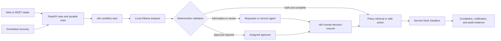

# AI Service Request Automation

AI Service Request Automation is a zero-cost local workflow for handling policy
questions, incident reports, access requests, data-change requests, and status
requests. It combines AI-assisted request understanding with deterministic
business rules, human decisions, durable state, API delivery, and recovery
evidence.

The project demonstrates a complete controlled lifecycle while preserving a
critical operational boundary: the locked 50-case evaluation found that the
current local model pipeline still requires human review for reliable use.

## Business Problem

Service teams repeatedly interpret requests, verify required information,
consult policies, decide routes, create downstream records, and communicate
outcomes. Manual handling makes consistency, duplicate protection, recovery,
and auditability difficult to maintain.

## Delivered Workflow



FastAPI and PostgreSQL remain authoritative for permissions, state transitions,
idempotency, approvals, retries, and evidence. n8n coordinates asynchronous
handoffs. Ollama supplies local language and embedding models. A separate
Service Desk Sandbox makes downstream success, replay, transient failure, and
permanent failure reproducible.

## Verified Evidence

| Evidence | Result |
| --- | ---: |
| Combined local lifecycle | 7/7 integration groups passed |
| Scheduled recovery and operations | 6/6 integration groups passed |
| Locked evaluation population | 50/50 cases completed |
| Request-type classification macro F1 | 94.6% |
| Required-field accuracy | 88.3% |
| Route and final-state accuracy | 30.0% |
| Semantic task success | 20.0% |
| Workflow-control pass rate | 100.0% |
| Recoverable-failure pass rate | 100.0% |
| Hosted or paid AI calls | 0 |

The fixed locked-evaluation gate is `CHECK`, not `PASS`. All 8 policy cases were
safely routed to `NEEDS_REVIEW` during proposal validation before retrieval, so
the end-to-end run recorded 0.0% policy Recall@3 and 0.0% citation validity.
This result shows that the workflow control plane and human-safe fallback worked
as designed, while the selected local analysis pipeline is not yet suitable for
unattended semantic processing.

See [Evaluation Results](docs/EVALUATION_RESULTS.md) for the fixed targets,
evidence hashes, latency, and interpretation.

## Technology

- Python 3.13, FastAPI, and server-rendered HTML;
- PostgreSQL 17 with pgvector;
- n8n 2.33.2;
- Ollama with `qwen3:4b-instruct` and `qwen3-embedding:0.6b`;
- Docker Compose and PowerShell; and
- a separate FastAPI and PostgreSQL Service Desk Sandbox.

## Repository Guide

| Path | Purpose |
| --- | --- |
| `application/` | Primary API, portal, business rules, workers, and recovery |
| `sandbox/` | Isolated downstream Service Desk API and database |
| `n8n/` | Versioned workflow definitions and setup assets |
| `sql/` | Additive primary-database migrations and fictional seed data |
| `evaluation/` | Locked evaluation contract and fictional cases |
| `checks/` | Centralized final runners and Compose definitions |
| `docs/` | Architecture, contracts, results, and portfolio handoff |
| `output/locked_evaluation/` | Tracked final v1 evaluation evidence |

The root-level `check_*.cmd`, `compose.*.yaml`, and matching scripts preserve the
focused component checks that produced earlier contract evidence. They are
reproducibility assets; the later combined checks use the centralized
`check.cmd` launcher.

## Controlled Reproduction

Prerequisites are Windows PowerShell, Docker Desktop with Docker Compose, and
the accepted Ollama models already installed. The runners use fictional data,
temporary credentials, disposable storage, and cleanup verification.

```powershell
.\check.cmd end-to-end
.\check.cmd recovery-operations
```

The accepted locked result is frozen and must not be rerun to improve its
scores. `check.cmd locked-evaluation` is retained for an independent clean
reproduction; such a run creates separate evidence and does not replace the
accepted v1 result in this repository.

## Guided Local Demo

The disposable guided demo provides a browser-based learning surface with 4
fictional roles, 3 prepared human-decision cases, and 1 optional idempotent
Ollama analysis case. It is separate from the frozen evaluation evidence.

```powershell
.\demo.cmd start
```

Then follow [Guided Local Demo](demo/README.md). The demo binds the portal only
to `127.0.0.1`, downloads no model, and ends with `demo.cmd stop`, which removes
its disposable database, containers, network, temporary secrets, and loaded
language model.

The full walkthrough was verified locally on 2026-08-20: requester,
service-agent, approver, and administrator boundaries behaved as designed; the
first Ollama execution made 1 local model call; its proposal failed the exact
v1 schema and was safely routed to `NEEDS_REVIEW`; the exact replay made 0 model
calls; and disposable cleanup passed. This learning result does not replace or
improve the frozen evaluation scores above.

## One-Command Showcase (Recommended)

For a first-time viewer, this recommended path presents the complete workflow
in 1 controlled run:

```powershell
.\showcase.cmd
```

The command runs the verified 7-case lifecycle with controlled fixture AI,
local n8n, PostgreSQL, and the fictional Service Desk Sandbox; generates and
opens `output\showcase-report.html`; and removes its disposable services and
temporary evidence. The same report file is overwritten on every run. It makes
0 Ollama, hosted, or paid AI calls and does not alter the locked evaluation.

The report explains the equivalent always-on company workflow, the 7
fictional case outcomes, human and safety gates, verified controls, and the
fixed `CHECK` evidence boundary. The role-based guided portal remains available
for optional interactive access-control inspection.

## Evidence and Scope

The evidence comes from controlled local runs with fictional users, policies,
requests, and downstream records. It demonstrates implemented integration,
workflow controls, deterministic safeguards, and honest local-model evaluation.
It does not represent production deployment, real users, or measured business
impact.

The project is available under the [MIT License](LICENSE).
